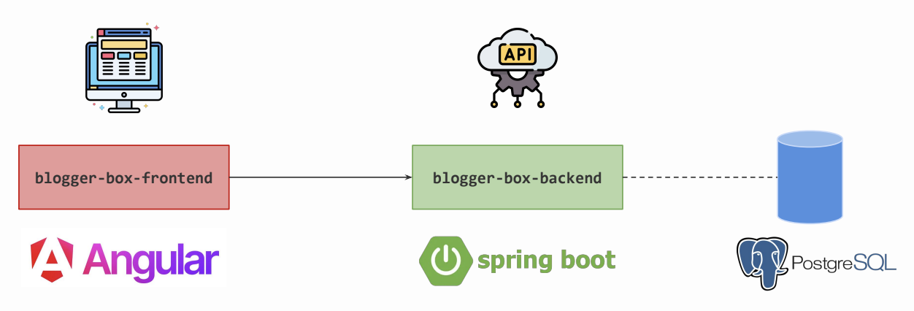
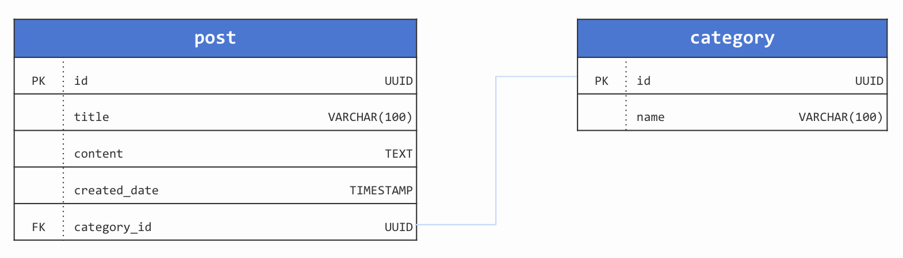

# Blogger-Box Frontend

Welcome to the Blogger-Box Project frontend implementation. Note that there is no single correct way to develop an application. Code implementation and preferences may vary from one developer to another. However, the primary goal is to deliver a stable application with easily maintainable code.

## Architecture

  

## Database Diagram

  

## Main Features

- **List all Posts on the Home Screen**: Displays a comprehensive list of all blog posts on the main page for easy navigation and reading.
- **Publish Posts**: Allows users to create and publish new blog posts through an intuitive interface.
- **Form Validations**: Ensures that all forms within the application are validated for correctness and completeness before submission.
- **Integration of "SweetAlert2"**: Utilizes "SweetAlert2", an open-source library, for enhanced alert and pop-up functionalities within the application.
